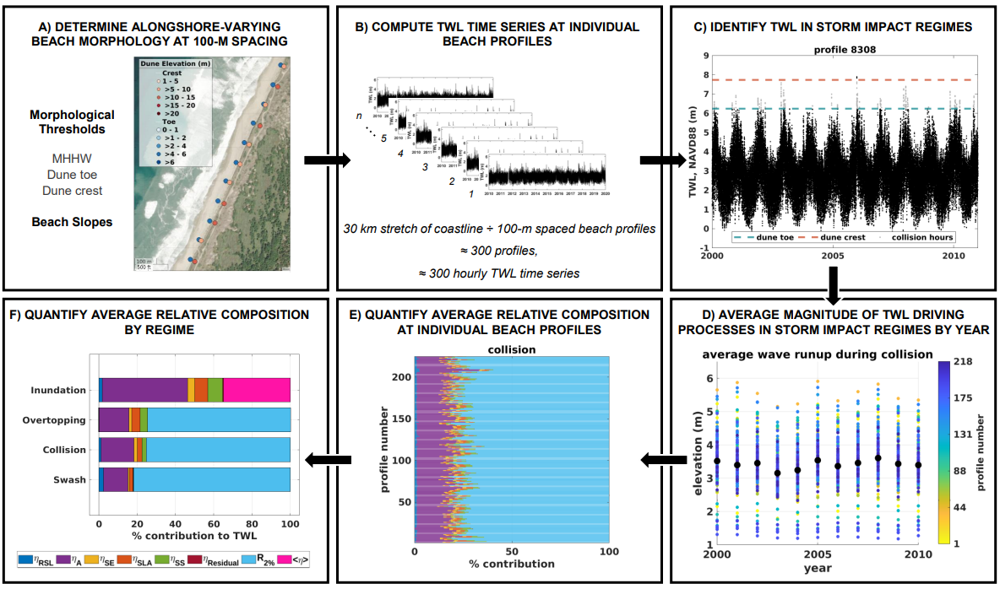

# TWLComposition-during-ImpactRegimes
Data release accompanying the paper "Total Water Level Driving Processes Influence the Potential for Coastal Change along United States Coastlines"

## Overview
This repository provides the script and datasets used to reproduce the analysis described in Section 2.1 of the manuscript and illustrated for an example station (Duck, NC).

This MATLAB script quantifies the relative contribution of individual water level components to the total water level (TWL) during Sallenger's (2000) Storm Impact Scale Regimes swash, collision, overtopping, and inundation. Outputs include: 
- TWL relative composition for each impact regime, averaged across years at each individual beach profile.
- TWL relative composition averaged across beach profiles during impact regimes at the example station.

  

<em>Figure 1. Steps for determining the relative contribution of individual water level components to the total water level (TWL) during storm impact regimes in Charleston, OR. Colors in the contribution plots represent processes as follows: relative sea level (ηRSL, dark blue), astronomical tides (ηA, purple), seasonality (ηSE, yellow), sea level anomalies (ηSLA, orange), storm surge (ηSS, green), residual (ηresidual, red), wave runup (R2%, light blue) for swash, collision, and overtopping, and wave setup (&lt;η&gt;, pink) for inundation. Panels illustrate: A) alongshore-varying morphological thresholds at 100-m spaced beach profiles, B) computation of hourly TWL time series at individual beach profiles, C) classification of hourly TWLs into storm impact regimes, D) wave runup magnitudes during collision at individual beach profiles (colored dots) and their annual averages across profiles (black dots), E) TWL relative composition during collision at individual beach profiles, and F) TWL relative composition averaged across beach profiles during swash, collision, overtopping, and inundation.</em>

---

## Repository Contents

1. **[`TWLcomposition_byProfile_wrapper.mlx`](TWLcomposition_byProfile_wrapper.mlx)**
Main script for quantifying the TWL relative composition during the swash, collision, overtopping, and inundation regimes at the example station Duck, NC. The script is organized in three parts:
   i) quantification of TWL relative composition during impact regimes;  
   ii) creation of figures to display results;  
   iii) assignment of percentile ranks to TWL elevations matching each regime threshold using the ECDF of hourly TWL.

2. **[`datasets`](datasets/)**
Input data required by the main script.
         - **`duck2025_hourly_shoaledwaves.mat`**  
     Contains the structure variable `hourlyData` with fields:

| Field      | Description |
|-------------|-------------|
| `tide`     | Astronomical tide (m) |
| `wl`       | Original NOAA water level record (m) |
| `seasonal` | Seasonal signal (m) |
| `msl`      | Relative mean sea level + sea level anomalies (m) |
| `time`     | MATLAB `datenum` time |
| `swh`      | Linearly back-shoaled significant wave height (m)† |
| `tp`       | Peak wave period (s)† |
| `ss`       | Storm surge (m) |
| `r2`       | Wave runup (m), computed using a 0.05 mean beach slope (recalculated per profile) |
| `setup`    | Wave setup (m), computed using a 0.05 mean beach slope (recalculated per profile) |
| `twl`      | Total water level (m) |
| `swl`      | Still water level (m) |
| `residual` | Residual signal (m), difference between measured and reconstructed SWL |

† Hourly significant wave height and peak wave period were obtained from the Global Ocean Waves version 2.0 (GOW2.0) hindcast dataset (Pérez et al., 2017) and linearly back-shoaled to deep water.

*More details about the fields in `hourlyData` are provided in the manuscript’s Methods & Datasets section and in Quadrado & Serafin (2024).*

   - **`morphology_NorthCarolinaDuck.csv`**  
     Morphological profile data from the **2018-308-DD** LiDAR survey (U.S. Geological Survey; Doran et al., 2020).

     | Column          | Description |
     |-----------------|-------------|
     | `state`         | U.S. state |
     | `segment`       | Segment number |
     | `profile`       | Profile number |
     | `lon`           | Longitude |
     | `lat`           | Latitude |
     | `x`             | Cross-shore distance (m) |
     | `z`          | Elevation (m) |
     | `x_err`         | Error associated with `x` |
     | `elev_err`      | Error associated with `z` |
     | `beach_width`   | Beach width (m) |
     | `mean_slope`    | Mean beach slope |
     | `feature_type`  | 1 = shoreline; 2 = dune toe; 3 = dune crest |

4. **[`functions`](functions/)**  
   Contains supporting MATLAB functions used in the main script.

   | Function | Description |
   |-----------|-------------|
   | `CalcStockdonR2.m` | Calculates wave runup using the Stockdon et al. (2006) empirical model. |
   | `overThresholdContribution_byProfile.m` | Main function that quantifies TWL contributions during each regime. A schematic of this workflow is shown in Figure 1 below. |
   | `plotTWLCompositionRegimes.m` | Generates and saves figures showing TWL relative composition results. |
   | `thresholdWLPercentiles.m` | Computes percentile ranks of TWL elevations corresponding to regime thresholds (swash, collision, overtopping, inundation). |

---

## Citation

If you use this repository or the associated data/products, please cite the repository and its associated manuscript as follows:

>Quadrado GP, Serafin KA. *Total water level driving processes influence the potential for coastal change along United States coastlines.* Cambridge Prisms: Coastal Futures. 2025;3:e28. *DOI:[https://doi.org/10.1017/cft.2025.10018].

---

## References

- Doran KS, Long JW, Birchler JJ, Brenner OT, Hardy MW, Morgan KLM, Stockdon HF and Torres ML (2020) *Data Release - Lidar-derived Beach Morphology (Dune Crest, Dune Toe, and Shoreline) for U.S. Sandy Coastlines.* St. Petersburg, FL: USGS. Retrieved from https://coastal.er.usgs.gov/data-release/doi-F7GF0S0Z/
- Perez J, Menendez M and Losada IJ (2017) GOW2: A global wave hindcast for coastal applications. Coastal Engineering 124, 1–11. https://doi.org/10.1016/J.COASTALENG.2017.03.005.
- Quadrado GP and Serafin KA (2024) *The Timing, Magnitude, and Relative Composition of Extreme Total Water Levels Vary Seasonally Along the U.S. Atlantic Coast.* Journal of Geophysical Research: Oceans 129(9), e2023JC020557. https://doi.org/10.1029/2023JC020557. 
- Sallenger AH (2000) *Storm Impact Scale for Barrier Islands*. Journal of Coastal Research 16(3), 890–895.
- Stockdon HF, Holman RA, Howd PA, and Sallenger AH (2006) *Empirical parameterization of setup, swash, and runup.* Coastal Engineering 53(7), 573–588. https://doi.org/10.1016/J.COASTALENG.2005.1
---

